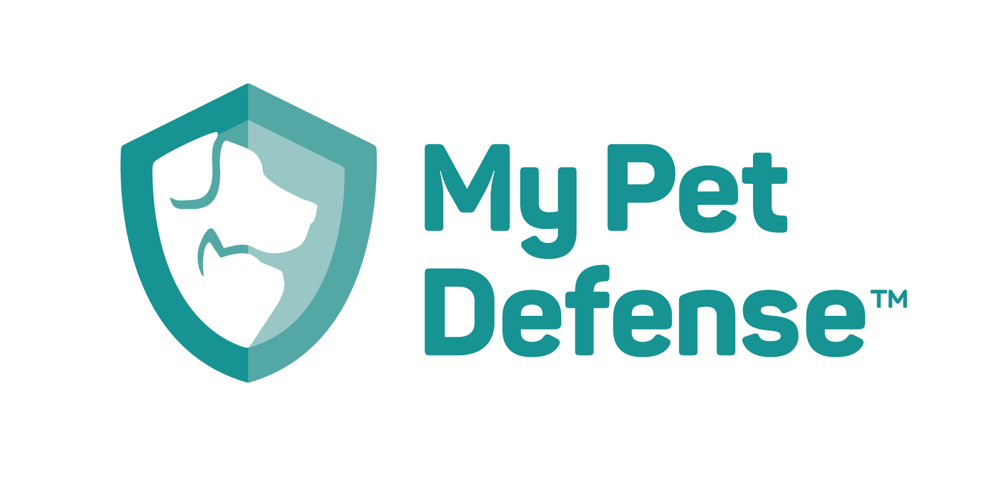

###[MyPetDefense.com](mypetdefense.com)

### Business Overview
At the core My Pet Defense (MPD), is a service that provides Flea & Tick (F&T) medicine one dose/month at a time and billing as such. This is a large change for the industry, as most purchases are for 3, 6, or 12 months at a time. 

Given this, MPD is an attempt to solve multiple problems, for both consumers and retailers. 

#### Consumer Problems and Solutions
Consumers have to purchase F&T at 3, 6, or 12 doses. This leads to several issues:

1. Spending a large amount of money up front.
1. Storing the extra product without losing it.
1. Remember where the product is and giving it to the animal every month.

If the consumer loses the product, more money must be spent. Given that the large upfront cost may already deter the consumer, buying a  second supply is another deterent from treating their pet. Additionally, if the product is not applied the same time every month, the product is not going to be as effective as possible.

MPD solves these issues by:

1. Charging monthly only for the product ordered.
1. Only sending the product to the consumer as they are charged.
1. Sending the product on the same day every month so that the consumer applies it immediately when received. 

#### Retailer Problems and Solutions
Retailers face a number of problems when it comes to F&T as well.

1. Consumers are able to buy the product from any store or site and thus build no brand loyalty.
1. Consumers may decide the product is too expensive and not purchase at all.

MPD solves these issues by:

1. Paying a percentage of every consumer transaction that is referred to MPD back to the retailer every month.
1. Breaking down the price point until the consumer all but forgets about the charge (hello gym memberhsip).

##### Example Scenario
Mike buys a dog from Pets R Us and is referred to MPD. Mike pays $10 every month for product and MPD pays 10% ($1) to Pets R Us as long as Mike is an active consumer on MPD. This will generate $12 annually for Pets R Us with no further action.

There are other secondary benefits to all parties as well, but those do not need to be detailed here.

### Technology Overview
The solution for this should be pretty straightforward. The biggest forseen issue will be scale of databases.

#### Stack / Service Providers
* Langauge: Scala / Lift
* DB Local: Postgres (flexible)
* DB Production: ???
* Cloud host: Currently [Linode.com](Linode.com) due to existing account but not tied.
* Credit Card Processor: [Stripe.com](Stripe.com)
* Postage Processor: [Stamps.com](Stamps.com)
* Transactional Email: [Postmarkapp.com](Postmarkapp.com)

#### Signup Flow
The signup flow will be integrated into the marketing pages and should be a simple 4 step process:

`Choose Pet` -> `Choose Size` -> `Choose Product` -> `Checkout`

#### Referer / Retail Flow
There will be flows built out for the sales team to report new retailers and for retailers to provide mailing and email addresses for potential new consumers. These are still TBD. Safe to assume more tables here.

#### Tech Flow
Once a new user signs up, we bill their card and send out the first product.

`Signup` -> `Charged by Stripe` -> `Notify MPD` -> `Generate label @ Stamps.com` -> `Print label and notify consumer` -> `Ship`

The flow for existing users is the same minus the `Signup` portion. Stripe will charge them every month, notify us, and we ship. 

#### Challenges
The goal of the site and service is `set and forget`, so we dont expect them to visit the consumer site often. We do expect a large number of users though. The industry is a $3B industry, so getting 1% would be $30M. So scale is a factor. 

Our first large retailer is giving us access to 300,000+ past consumers as well as 42,000+ new consumers annually. This will lead to large tables that are the core of our business. We need to ensure we have dedundency setup correctly as well as the ability to handle growth. While this is the first retailer, hopefully it is not the last.
